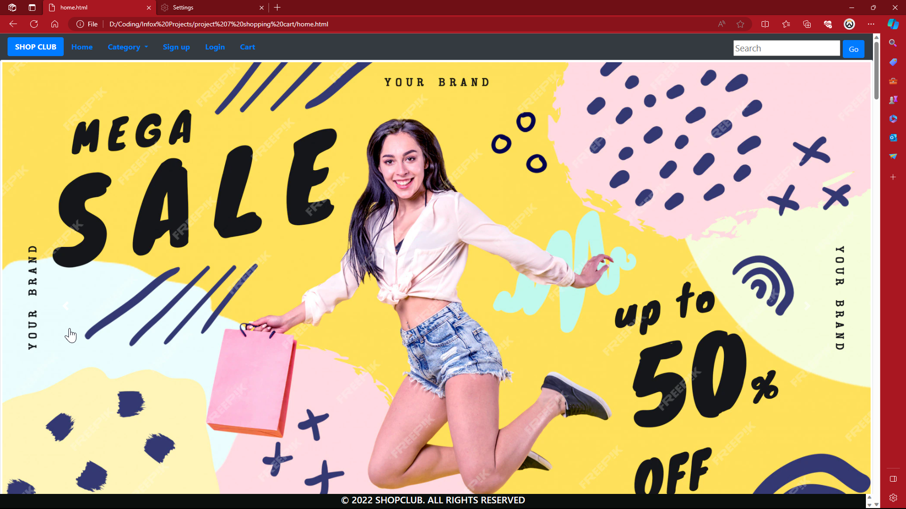
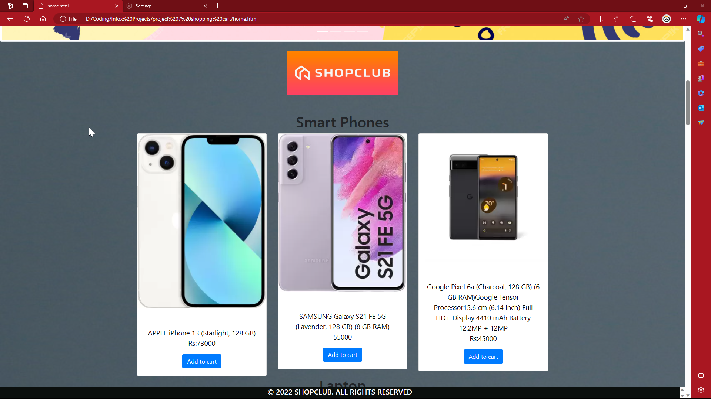
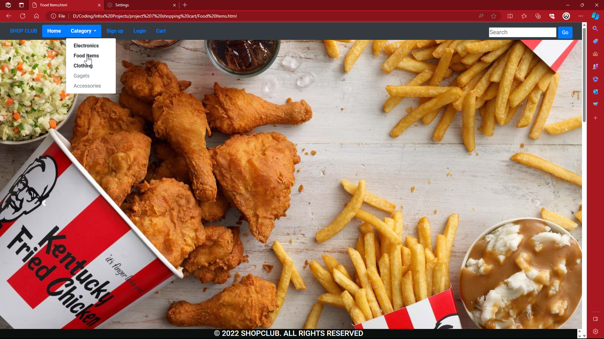
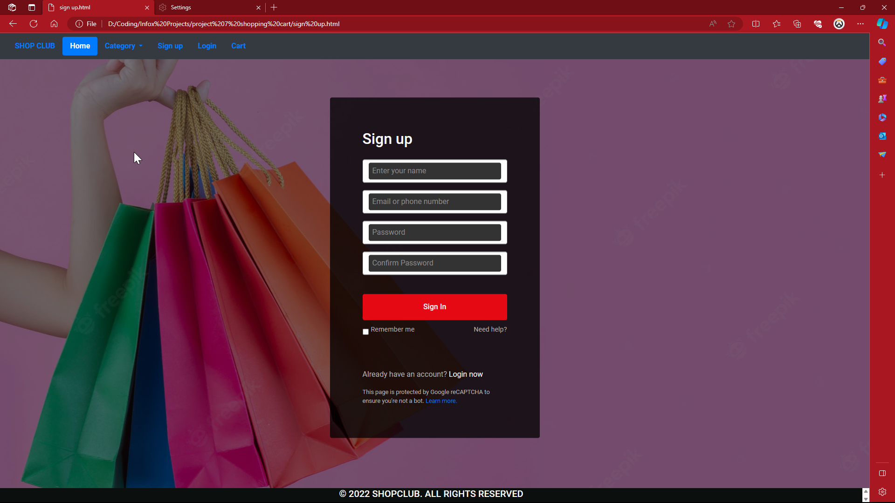

# A visually stunning front-end project I completed in 2022, crafted with HTML & CSS

Captivating Product Cards: 

Each item boasts an enticing card design, featuring crisp product images and clear details that grab attention and facilitate 
informed purchase decisions.
Effortless Navigation: ShopClub prioritizes user experience. The intuitive navbar empowers you to navigate seamlessly between the Home Page, Login and Signup 
functionalities, and your personalized Shopping Cart.

Streamlined Pagination: Delve into a vast product collection with ease! Each category page incorporates pagination, ensuring a smooth browsing experience 
regardless of selection size.

This project highlights my expertise in:
Crafting user-centric and interactive web interfaces.
Harnessing the power of HTML to structure compelling web pages.
Designing an aesthetically pleasing layout with clear product categorization.

ShopClub serves as a testament to my front-end development proficiency from 2022. I'm fueled by the desire to continuously learn and build even more 
captivating e-commerce experiences in the future!

#html #ecommerce #frontend #webdev #shopclub
